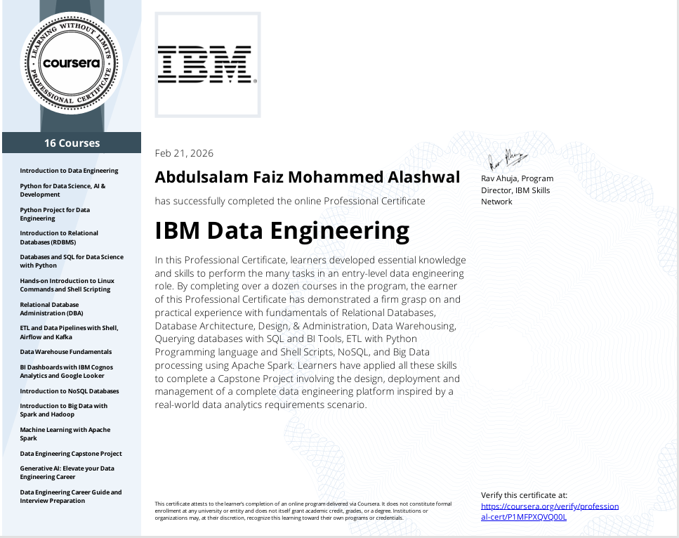
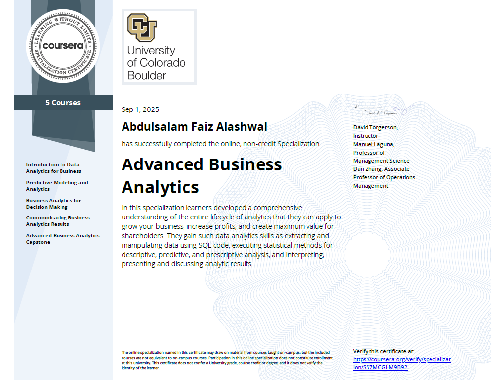
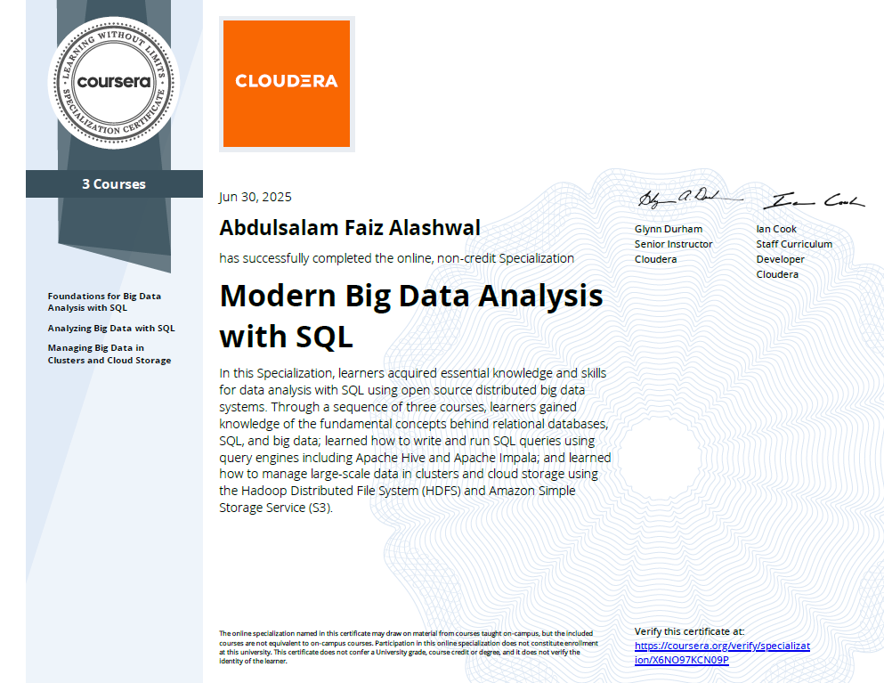
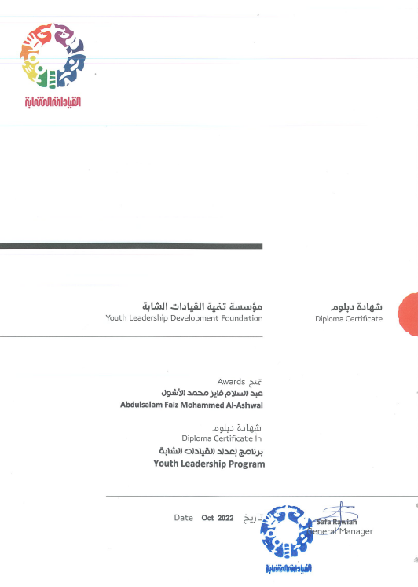

# عبد السلام الأشول
### محلل بيانات ومهندس بيانات | مطور أنظمة وبرمجيات

  

 

  <a href="README.md"><b>English (English Version)</b></a>

 

  
  
  
  

---

## نبذة عني

أنا محلل بيانات ومهندس بيانات متخصص في أتمتة خطوط نقل ومعالجة البيانات (ETL/ELT)، وتصميم قواعد البيانات، وتطوير الأنظمة البرمجية المخصصة. تغطي خبرتي تصميم قواعد البيانات المترابطة للمؤسسات، وفك الارتباط بين تطبيقات الأعمال المعقدة وتحويلها إلى نسخ خفيفة ومستقلة، وبناء لوحات مراقبة وتحليل البيانات القوية. أركز على ترجمة هياكل البيانات المعقدة إلى أنظمة واضحة وموثوقة تسهم في تحسين العمليات التجارية.

*   **الموقع**: اليمن
*   **اللغات**: العربية (اللغة الأم) والإنجليزية (مستوى مهني)
*   **المنهجية**: إذا كانت هناك عملية عمل يدوية ومتكررة، فيمكن ويجب أتمتتها.

---

## أدواتي التقنية

*   **ذكاء الأعمال (BI)**:  
      
*   **هندسة البيانات والأنظمة**:  
          

---

## أبرز المشاريع

### 1. [لوحة أبحاث وتحليلات السوق المالية](https://github.com/abdulsalamfaiz2024-cmd/financial-intelligence-agent)
*أداة لتحليل السوق تقوم بجمع البيانات المالية في الوقت الفعلي لإجراء التحليلات الفنية وتحليل المشاعر.*
*   **النظام**: تم بناؤه باستخدام واجهة خلفية برمجية بلغة بايثون بشكل برمجيات مجزأة تجمع تدفقات البيانات المالية المباشرة من Yahoo Finance و Alpha Vantage.
*   **مخزن البيانات**: يستخدم قاعدة بيانات متجهات ChromaDB وتخزينًا مؤقتًا محليًا لاسترجاع مذكرات التحليل التاريخي بسرعة فائقة.
*   **الواجهة والـ API**: يستخدم FastAPI لتقديم البيانات للوحة تحكم Streamlit تفاعلية ومزودة بمخططات Plotly.
*   **التقنيات المستخدمة**: `Python`، `FastAPI`، `Streamlit`، `ChromaDB`، `scikit-learn`.

### 2. [مركز قيادة رصد وتحليل البيانات في اليمن](https://github.com/abdulsalamfaiz2024-cmd/yemen-crisis-dashboard)
*منصة بيانات جغرافية تجمع وتعرض بيانات الطقس الحية والمؤشرات الإنسانية لمحافظات اليمن.*
*   **الرابط المباشر**: [yemen-crisis-dashboard.vercel.app/health](https://yemen-crisis-dashboard.vercel.app/health)
*   **العناصر المرئية**: تدمج خرائط Leaflet.js مع واجهة HTML5 Canvas مخصصة تحاكي حركة الرياح ديناميكيًا بناءً على قيم قاعدة البيانات المباشرة.
*   **خطوط نقل البيانات (ETL)**: تقوم نصوص برمجية تعمل في الخلفية بجلب معاملات الطقس كل 5 دقائق من Open-Meteo API، ودمجها مع موجزات الأخبار الإنسانية من ReliefWeb (OCHA) ومؤشرات السكان العامة.
*   **التحليلات**: تعرض لوحة التحكم مخططات رادارية وشبكية تفاعلية باستخدام Chart.js توضح مؤشرات الغلاف الجوي وتطورات الحالات الطبية ومعدلات الحضور المدرسي المحاكاة.
*   **التقنيات المستخدمة**: `Python`، `Flask`، `SQLite`، `Leaflet.js`، `Chart.js`.

### 3. [PhonixPro — منصة تحليلات البيانات وإعداد التقارير](https://github.com/abdulsalamfaiz2024-cmd/phonix-pro)
*تطبيق ويب مصمم لتبسيط النمذجة الإحصائية، وتنظيف البيانات، وإعداد التقارير للأعمال.*
*   **الرابط المباشر**: [phonixpro.ddns.net](https://phonixpro.ddns.net/)
*   **المميزات**: يدعم سحب وإسقاط ملفات CSV/Excel، والتعرف التلقائي على أنواع البيانات، وإجراء الإحصاء الوصفي (التحليل الأساسي للمكونات PCA، والتجميع، والانحدار)، وتصدير التقارير بصيغة PDF.
*   **التفاعل**: يتضمن مساعد استعلام عن البيانات باللغة الطبيعية، وهياكل تخطيط ذكية، وتوصيات ذكية لتنظيف البيانات.
*   **التقنيات المستخدمة**: `Next.js 15`، `React`، `Python`، `PostgreSQL`، `Redis`، `Framer Motion`.

### 4. [COMS — النواة البرمجية المستقلة لإدارة الأعمال](https://github.com/abdulsalamfaiz2024-cmd/coms-standalone-core)
*فك الارتباط لتطبيق إدارة عمليات استشارية معقد عن إطار العمل الثقيل ERPNext/Frappe وتطويره كنظام مستقل وخفيف الوزن.*
*   **الرابط المباشر**: [custom-system-copy.onrender.com](https://custom-system-copy.onrender.com)
*   **منطق النظام الأساسي**: تطوير أداة مخصصة بلغة بايثون لمحاكاة وظائف الفحص والاستعلام في قاعدة بيانات إطار Frappe، مما يلغي الحاجة لتثبيت أو تشغيل بيئة Frappe الكاملة.
*   **قاعدة البيانات والخادم**: نقل كافة هياكل البيانات إلى SQLite وتغليف النظام في خادم REST باستخدام Flask/FastAPI.
*   **الهجرة والترحيل**: تطوير نصوص برمجية لاستخراج ونقل البيانات بأمان من الأنظمة القديمة مع الحفاظ على تكامل البيانات والروابط المرجعية.
*   **التقنيات المستخدمة**: `Python`، `SQLite`، `Flask`، `FastAPI`.

### 5. [Mini-ERP — نظام إدارة المبيعات والمخزون](https://github.com/abdulsalamfaiz2024-cmd/mini-erp-system)
*تطبيق أعمال مكتبي يتعامل مع عمليات البيع، وتقييم المخزون، وإعداد التقارير المالية الأساسية.*
*   **المنطق البرمجي**: تطبيق منهجية الوارد أولاً يصرف أولاً (FIFO) لتقييم المخزون، ودورة دفع المعاملات المكتملة، وتخزين مؤقت لتقليل استعلامات قاعدة البيانات وزيادة السرعة.
*   **سهولة الاستخدام**: يتضمن اختصارات لوحة المفاتيح (Ctrl+K)، والوضع الداكن والفاتح، والتحقق التلقائي من هيكل قاعدة البيانات عند التشغيل، وإصدار الفواتير بصيغة PDF.
*   **التقنيات المستخدمة**: `Python`، `Tkinter`، `SQLite`، `ReportLab`.

### 6. [مستخرج نصوص البودكاست — أنبوب معالجة النسخ الصوتي](https://github.com/abdulsalamfaiz2024-cmd/podcast-text-extractor)
*أنبوب مراقبة ومعالجة ملفات يقوم تلقائيًا باستخراج الصوت من ملفات الوسائط ونسخه وتنسيق المخرجات.*
*   **سير العمل**: يكتشف ملفات الفيديو/الصوت الجديدة، ويستخدم أداة FFmpeg لتهيئة الصوت وتطبيعه، ويقوم باستدعاء نموذج Whisper محلي لنسخ المحتوى الصوتي إلى نص.
*   **التنسيق**: يعالج النصوص المنسوخة لإضافة علامات الترقيم، والطوابع الزمنية، والتنسيق المناسب، ويقوم بتصديرها بصيغتي Markdown و JSON.
*   **التقنيات المستخدمة**: `Python`، `Whisper`، `FFmpeg`، `FastAPI`.

### 7. [PDF Pro Scanner — تطبيق متعدد المنصات لأدوات المستندات](https://github.com/abdulsalamfaiz2024-cmd/pdf-pro-scanner)
*مجموعة أدوات للتعامل مع المستندات تتميز بواجهة ويب خفيفة الوزن وتطبيق هاتف محمول يعمل على مختلف الأنظمة.*
*   **موقع الويب**: تم بناؤه باستخدام React و Vite لدمج ملفات PDF وتعديل الصور والتعرف البسيط على النصوص على المتصفح مباشرة ودون خوادم.
*   **تطبيق الجوال**: تطبيق جوال مبني بإطار Flutter مصمم لمسح المستندات وتنسيقها في مجلدات بلا offline مع دعم واجهات متعددة اللغات.
*   **التقنيات المستخدمة**: `Flutter`، `React`، `Vite`، `TypeScript`.

### 8. [Hotline — بوابة الشحن والخدمات اللوجستية ثنائية اللغة](https://github.com/abdulsalamfaiz2024-cmd/hotline-logistics-web)
*صفحة هبوط وبوابة عملاء متعددة الصفحات تم تطويرها لشركة شحن وخدمات لوجستية.*
*   **الرابط المباشر**: [hotline-web-three.vercel.app](https://hotline-web-three.vercel.app/)
*   **التصميم**: واجهة أمامية متجاوبة تتميز بحركات وتأثيرات مخصصة، مع دعم كامل للترجمة بين اللغتين العربية والإنجليزية واستمارات استعلام الشحن التفاعلية.
*   **الأداء**: تم تحسين سرعة تحميل الصفحات من خلال معالجة الصور وضغط العناصر، وتطبيق أفضل ممارسات تحسين محركات البحث (SEO).
*   **التقنيات المستخدمة**: `Next.js 15`، `React`، `Tailwind CSS`، `Lucide`.

### 9. [تصميم قاعدة البيانات المترابطة لشركة TNSC](https://github.com/abdulsalamfaiz2024-cmd/tnsc-database-schema)
*مخطط قاعدة بيانات PostgreSQL مهيأ ومحسّن لنقل العمليات المعقدة لإحدى الشركات الاستشارية من الجداول المبعثرة إلى قاعدة بيانات منظمة عالية الدقة.*
*   **الهيكل**: يتميز بـ 36 جدولاً خالية من التكرار تمامًا، وفهارس مركبة محسّنة، و 6 طرق عرض (Views) مخصصة لمتابعة إنتاجية الموظفين والتقارير المالية.
*   **القواعد والمشغلات**: يستخدم معرفات UUID كمفاتيح أساسية، وأعمدة ثنائية اللغة، وقواعد للحذف المؤقت (Soft-Delete)، ومشغلات تلقائية لتسجيل سجلات التدقيق (Audit Logs).
*   **التقنيات المستخدمة**: `PostgreSQL`، `Relational Schema Design`، `Query Optimization`.

---

## المسيرة المهنية

*   **محلل ومهندس بيانات متدرب** لدى *مجموعة هائل سعيد أنعم (HSA)* *(يناير 2026 – الحالي)*
    *   تصميم لوحات تحكم المبيعات التفاعلية والمؤشرات الرئيسية باستخدام بيانات نظام SAP ERP، مما أدى لتحسين سرعة وكفاءة التقارير التجارية.
*   **مساعد رصد وتقييم** لدى *مؤسسة تمدين شباب* *(يناير 2025 – ديسمبر 2025)*
    *   تطوير أطر الرصد الموجه نحو النتائج (ROM) وبرمجة نصوص مخصصة بلغة بايثون للتحقق من جودة وسلامة البيانات.
*   **محلل أعمال (دوام جزئي)** لدى *شركة تريبل نيكسوس الاستراتيجية (TNSC)* *(يونيو 2024 – ديسمبر 2024)*
    *   بناء مصفوفات تتبع العمليات ولوحات معلومات ذكاء الأعمال التي ساهمت في تحديث قنوات تقديم الخدمات الاستشارية.

---

## التعليم والشهادات

### المؤهل الأكاديمي

> **بكالوريوس العلوم (B.Sc.) في إدارة الأعمال الدولية**
> *جامعة تكنولوجيا توينتيك العالمية (IUTT)، اليمن*

---

### الشهادات والبرامج المتخصصة

*   **شهادة تخصص هندسة البيانات من IBM** (برنامج مكون من 16 دورة) - *IBM عبر منصة كورسبيرا* | [تحقق ↗](https://coursera.org/share/b92252a31c9217759bbdb98be201608e)
     
    
*   **شهادة تخصص تحليلات الأعمال المتقدمة** (برنامج مكون من 5 دورات) - *جامعة كولورادو عبر منصة كورسبيرا* | [تحقق ↗](https://coursera.org/verify/specialization/SS7MCGLM9B92)
     
    
*   **شهادة تخصص تحليل البيانات الضخمة الحديثة باستخدام SQL** (برنامج مكون من 3 دورات) - *كلوديرا عبر منصة كورسبيرا* | [تحقق ↗](https://coursera.org/share/0814333adf33da90fe2725ac5adc5b91)
     
    
*   **برنامج إتقان ريادة الأعمال** (برنامج مكون من 5 دورات) - *مؤسسة محمد بن راشد آل مكتوم وبرنامج الأمم المتحدة الإنمائي عبر منصة كورسبيرا* | [تحقق ↗](https://coursera.org/share/519ae898fa90c20a74d2589a8ae32aa9)
     
    
*   **برنامج إعداد القيادات الشابة** - *مؤسسة تنمية القيادات الشابة (YLDF)*
     *(يشمل: دبلوم اللغة الإنجليزية، دبلوم قيادة الحاسوب ICDL، ودبلوم القيادة والإلقاء أمام الجمهور)*
     
    

---

  <h2>التواصل والتعاون</h2>
  
إذا كنت تتطلع للتعاون في مشاريع هندسة البيانات، أو بناء لوحات تحكم ذكاء الأعمال (BI)، أو أتمتة العمليات اليدوية، يسعدني تواصلك معي:

  <table align="center">
    <tr>
      <td><b>البريد الإلكتروني</b></td>
      <td><a href="mailto:abdulsalamalashwal@outlook.com">abdulsalamalashwal@outlook.com</a></td>
    </tr>
    <tr>
      <td><b>الهاتف / واتساب</b></td>
      <td><a href="tel:+967775032054">+967 77 503 2054</a> / <a href="https://wa.me/967775032054">مراسلة عبر واتساب</a></td>
    </tr>
    <tr>
      <td><b>الروابط المهنية</b></td>
      <td><a href="https://www.linkedin.com/in/abdulsalam-alashwal/">ملف LinkedIn</a> | <a href="https://abdulsalam-portfolio.vercel.app/ar">موقع الويب التعريفي المباشر</a></td>
    </tr>
  </table>

